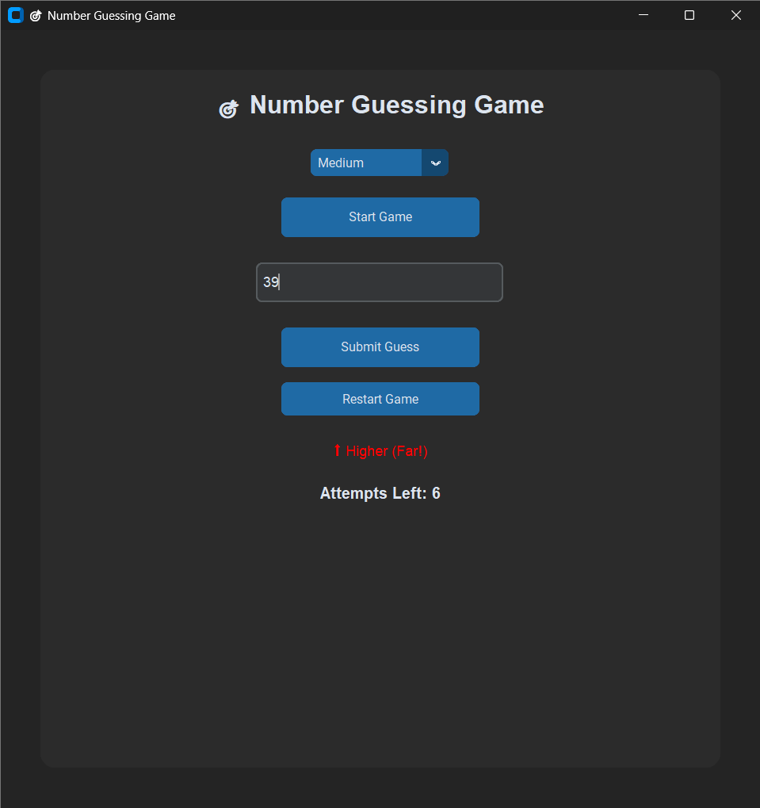

# 🎯 Number Guessing Game (Python)

## 📌 Overview
A Python Number Guessing Game available in both CLI and GUI versions, featuring difficulty levels, intelligent hints, scoring, and a modern CustomTkinter interface.

The GUI version is built using CustomTkinter and provides a modern, interactive experience.
The program generates a random number within a range based on the selected difficulty level. The user must guess the correct number within limited attempts. The game provides intelligent feedback such as "Higher", "Lower", and proximity hints like "Close" or "Very Close".

This project was created to practice Python programming, GUI development, and version control using Git.

---

## 🚀 Features
- Difficulty levels (Easy, Medium, Hard)
- Random number generation within dynamic ranges
- Input validation (handles invalid and out-of-range input)
- Smart hints (Very close / Close / Far)
- Limited attempts based on difficulty
- Score calculation system
- Replay option (play multiple rounds)
- Structured code using functions

### CLI Version
- Random number generation
- User input handling
- Attempt counter
- Higher/Lower hints

### GUI Version
- Modern dark-themed interface
- Real-time colored feedback
- Attempt tracking display
- Restart game option
- Auto-clearing input
- Game-state controls

---

## 📸 GUI Preview



## 🛠 Tech Stack
- Python 3
- CustomTkinter (GUI)
- Git
- GitHub

---
## 📂 Project Structure

```bash
number_guessing_game/
│
├── main.py
├── gui_game.py
├── README.md
└── assets/
    └── screenshot.png
```

---

## ▶️ How to Run

CLI Version:
```bash
python main.py
```

GUI Version:
```bash
python gui_game.py
```
---

## 🔄 Version History

### V1 — Basic CLI Prototype
- Random number guessing game
- Higher/Lower hints
- Attempt counter
- Single-round gameplay

---

### V2 — Enhanced CLI Game
Added:
- Difficulty levels
- Input validation
- Smart proximity hints
- Scoring system
- Replay support

---

### V3 — GUI Upgrade & Project Polish
Major upgrade from CLI to GUI using CustomTkinter.

Added:
- Modern dark-themed graphical interface
- Difficulty selector
- Real-time colored feedback
- Attempts tracking
- Restart game support
- Auto-clearing input field
- Game-state controls
- Improved UX and layout polish
- Screenshot documentation
- README and GitHub project improvements

---

## 🧠 Learning Goals

Through this project, I practiced:

- Writing modular and structured Python code
- Using loops, conditionals, and game-state logic
- Handling user input safely with validation
- Designing interactive game logic
- Building GUI applications with CustomTkinter
- Managing versions using Git and GitHub
- Debugging repo, import, and UI issues
- Improving UX through interface design

---

## 👩‍💻 Author
Smruthi  
BTech CSE(IoT) student
